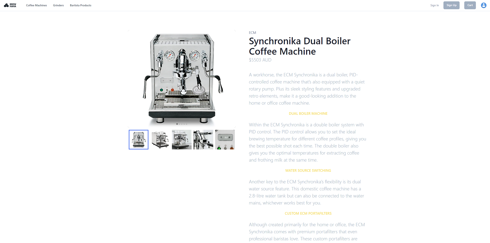

# BrewHaHa

## Description

This is an e-commerce full MERN stack website that customers can look for coffee products and purchase them.
It is built using a full MERN stack.

The puspose of the application is to allow customers to shop at the website. Looking at products, adding them to a cart and purchasing them.
The user can review products, change their profile details and view their previous orders.

## Table of Contents

- [Client Side](#client-side)
- [Server Side](#server-side)
- [Root Application Dependancies](#root-application-dependancies)
- [Server Environment Variables](#server-environment-variables)
- [Install Instructions](#install-instructions)
- [Executing Instructions](#executing-instructions)
- [Deployed](#deployed-link)
- [GitHub Link](#github-link)
- [Screenshot](#Screenshot)

---

## Client Side

The client side of the application is handled using ReactJS. React handles the client requests, page rendering and application state information.

### Client Dependancies

The client dependancies are as follows. This is a list of the main technologies, for a full list see the package.json in the /client folder

> @apollo/client  
> @chakra-ui/react  
> @stripe/stripe-js  
> graphql  
> jwt-decode  
> react  
> react-redux  
> react-router-dom

---

## Server Side

The server side of the application is handled using ExpressJS and ApolloServer. MongoDB was used with mongoose as the ODM

### Server Dependancies

The server dependancies are as follows. This is a list of the main technologies, for a full list see the package.json in the /server folder

> apollo-server-express  
> bcrypt  
> graphql  
> dotenv  
> express  
> graphql  
> jsonwebtoken  
> mongoose  
> stripe

---

## Root Application Dependancies

This application is split into two applications as listed above. I.E. the client and server applications.  
To manage them together, there exists a package.json located in the root directory that holds the scripts to build and run both applications.  
There is only one dependancy used in this location

> concurrently

This is used to simulate two concurrent processes, so that we can run both the client and server at the same time and from the same command line.

---

## Server Environment Variables

The server has abstracted some variable that would be considered provate. To implement this application you would need to implement a .env file within you /server folder  
Within this file there needs to be two variables.

```
JWT_SECRET="*Your_JWT_Passphrase*"
STRIPE_SERVER_KEY="*Your_Stripe_Private_Key*"
```

JWT_SECRET - is the JSON Web Token passphrase used to create the hash of the JWT. You can make this anything.  
STRIPE_SERVER_KEY - is the private key used for stripe transaction. You will need to obtain this though stripe.

## Install Instructions

All the build and run commands can be done through the root package.json file.  
This includes

```
cd server
npm i c
d ../client
npm i
```

This means that it will go to the server and run the install, then go to the client and run the install

## Executing Instructions

All the build and run commands can be done through the root package.json file.  
This includes

```
npm run develop
```

which will

```
concurrently \"cd server && npm run start\" \"cd client && npm start\
```

this means that it will preform two processes in parallel

```
cd server && npm run start\
```

go to the server and run start

```
cd client && npm start
```

go to the client and start

> both commands are done in parallel, so that both server and client applications are running

## Deployed Link

The link to the deployed website of the assignment is <br>
[https://murmuring-reef-81565.herokuapp.com/](https://murmuring-reef-81565.herokuapp.com/)

---

## GitHub Link

The link to the deployed website of the assignment is <br>
[https://github.com/jkoufalas/BrewHaha](https://github.com/jkoufalas/BrewHaha)

---

## Screenshot

This image provides a sample of the completed website.


